<p align="center">
  
</p>

<h1 align="center">TierPulse</h1>

<p align="center">
  <strong>High-scale financial sentiment intelligence for trading systems, market dashboards, and automation pipelines.</strong>
</p>

<p align="center">
  <a href="https://github.com/kabudu/tierpulse/actions/workflows/pipeline.yml"></a>
  <a href="https://opensource.org/licenses/MIT"></a>
  <a href="https://hub.docker.com/r/boxedcode/tierpulse"></a>
  
</p>

**TierPulse** is a Rust service that turns market news and provider-backed reasoning into low-latency sentiment signals. It is designed for production paths where upstream quota, latency, and partial provider outages are ordinary operating conditions, not surprises.

At runtime, TierPulse follows a three-tier intelligence strategy: fetch and batch market news, score available article context locally with an INT8 ONNX model, and escalate to configurable LLM providers only when news intelligence is exhausted or deliberately budget-limited.

## Key Features

- **Local-first sentiment:** Quantized ONNX FinBERT inference gives fast CPU-friendly results when provider news is available.
- **Provider failover:** News calls progress across Tiingo, MarketAux, Alpha Vantage, and Finnhub until each symbol is resolved or the request budget is exhausted.
- **Configurable LLM fallback:** Tier-3 execution order is controlled by `TP_LLM_PROVIDER_ORDER` across Grok, DeepSeek, and OpenAI.
- **Batch-aware orchestration:** Multi-symbol requests are grouped for provider calls and LLM analysis to reduce round trips.
- **Cache-efficient operation:** Moka handles in-process hot paths while Redis provides distributed cache reuse across containers.
- **Production guardrails:** Tenant and global rate limits, strict request validation, egress allowlisting, secret redaction, and typed error envelopes are built in.
- **Operational visibility:** Health probes expose tier/provider readiness, while Prometheus-style metrics report latency, cache hit rate, provider errors, fallback transitions, and exhaustion.
- **Release discipline:** Tags are guarded against `Cargo.toml` and `CHANGELOG.md`; Docker semver tags and GitHub Releases are produced by CI.

## Architecture

```mermaid
%%{init: {"theme": "base", "themeVariables": {"background": "#0b1020", "primaryColor": "#13213d", "primaryTextColor": "#f8fafc", "primaryBorderColor": "#38bdf8", "lineColor": "#7dd3fc", "secondaryColor": "#1f2937", "tertiaryColor": "#111827", "fontFamily": "Inter, ui-sans-serif, system-ui, sans-serif"}}}%%
flowchart LR
    client["Trading bots<br/>dashboards<br/>automation"] --> edge["HTTP API<br/>POST /api/v1/analyze"]
    edge --> auth["Auth, validation<br/>tenant and global limits"]
    auth --> cache{"Cache hit?"}

    cache -- "yes" --> response["Sentiment response<br/>score, label, confidence<br/>source tier, reasoning"]
    cache -- "no" --> orchestrator["TierPulse orchestration<br/>symbol batching<br/>request budget<br/>fallback tracking"]

    orchestrator --> news["Tier 2 news fanout"]
    news --> tiingo["Tiingo"]
    news --> marketaux["MarketAux"]
    news --> alphavantage["Alpha Vantage"]
    news --> finnhub["Finnhub"]

    tiingo --> articles["Normalized article set"]
    marketaux --> articles
    alphavantage --> articles
    finnhub --> articles

    articles --> onnx["Tier 1 local ONNX<br/>INT8 FinBERT<br/>model_labels.json"]
    onnx --> cache_store["Moka + Redis<br/>result cache"]
    cache_store --> response

    orchestrator -- "news unavailable<br/>or budget exhausted" --> llm["Tier 3 LLM fallback<br/>configured execution order"]
    llm --> grok["Grok / xAI"]
    llm --> deepseek["DeepSeek"]
    llm --> openai["OpenAI"]
    grok --> contract["Strict JSON contract<br/>label normalization"]
    deepseek --> contract
    openai --> contract
    contract --> cache_store

    health["/health/live<br/>/health/ready"] -.-> orchestrator
    metrics["/metrics<br/>latency, cache, provider errors<br/>fallback transitions"] -.-> orchestrator
    security["Secret redaction<br/>HTTPS egress allowlist<br/>bounded retries"] -.-> news
    security -.-> llm

    ci["GitHub Actions"] --> tests["fmt, clippy, tests<br/>contract tests, cargo audit"]
    tests --> image["Multi-arch Docker image<br/>boxedcode/tierpulse"]
    tests --> release["GitHub Release<br/>CHANGELOG section"]

    classDef user fill:#172554,stroke:#60a5fa,color:#eff6ff;
    classDef core fill:#0f766e,stroke:#5eead4,color:#ecfeff;
    classDef cacheLayer fill:#713f12,stroke:#facc15,color:#fffbeb;
    classDef provider fill:#581c87,stroke:#c084fc,color:#faf5ff;
    classDef ops fill:#164e63,stroke:#67e8f9,color:#ecfeff;
    classDef cicd fill:#7f1d1d,stroke:#fca5a5,color:#fff1f2;

    class client,edge user;
    class auth,orchestrator,onnx,response core;
    class cache,cache_store cacheLayer;
    class news,tiingo,marketaux,alphavantage,finnhub,llm,grok,deepseek,openai,contract provider;
    class health,metrics,security ops;
    class ci,tests,image,release cicd;
```



## Tech Stack

| Layer | Technology |
| :---- | :--------- |
| Runtime | Rust 2024 edition, MSRV 1.96, Tokio, Axum, Tower |
| Sentiment model | ONNX Runtime via `ort`, INT8 FinBERT by default |
| Caching | Moka in-memory cache, Redis distributed cache |
| Providers | Tiingo, MarketAux, Alpha Vantage, Finnhub, Grok, DeepSeek, OpenAI |
| Packaging | Multi-stage Docker build, distroless runtime image |
| CI/CD | GitHub Actions, Docker Buildx, Docker Hub, GitHub Releases |

## Getting Started

### 1. Environment Configuration

Create a `.env` file or set environment variables. All variables prefixed with `TP_` are used to configure the service.

| Variable                              | Default      | Description                                                                                                      |
| :------------------------------------ | :----------- | :--------------------------------------------------------------------------------------------------------------- |
| `PORT`                                | `8080`       | Server listening port.                                                                                           |
| `TP_TIINGO_KEY`                       | **Required** | Primary news provider API key.                                                                                   |
| `TP_FINNHUB_KEY`                      | `null`       | Tertiary news provider key (final fallback tier).                                                                |
| `TP_MARKETAUX_KEY`                    | `null`       | Secondary news provider key (batched fallback tier).                                                             |
| `TP_ALPHAVANTAGE_KEY`                 | `null`       | Additional batched fallback news provider key via Alpha Vantage `NEWS_SENTIMENT`.                                |
| `TP_GROK_KEY`                         | `null`       | xAI API key for Tier-3 LLM fallback.                                                                             |
| `TP_DEEPSEEK_KEY`                     | `null`       | DeepSeek API key for Tier-3 LLM fallback.                                                                        |
| `TP_OPENAI_KEY`                       | `null`       | OpenAI API key for Tier-3 LLM fallback.                                                                          |
| `TP_PRIMARY_LLM`                      | `grok`       | Backward-compatible hint for the first LLM provider when `TP_LLM_PROVIDER_ORDER` is unset.                       |
| `TP_LLM_PROVIDER_ORDER`               | derived      | Comma-separated Tier-3 execution order using `grok`, `deepseek`, and/or `openai`.                               |
| `TP_GROK_MODEL`                       | `grok-4.3`        | xAI chat-completions model used by the `grok` provider.                                                         |
| `TP_DEEPSEEK_MODEL`                   | `deepseek-v4-flash` | DeepSeek chat-completions model used by the `deepseek` provider.                                              |
| `TP_OPENAI_MODEL`                     | `gpt-5.4-nano`    | OpenAI chat-completions model used by the `openai` provider.                                                    |
| `TP_REDIS_URL`                        | `null`       | Redis URL for distributed caching (e.g., `redis://localhost:6379`).                                              |
| `TP_CACHE_TTL`                        | `300`        | In-memory/Redis cache expiration in seconds.                                                                     |
| `TP_AUTH_MODE`                        | `none`       | Authentication mode: `none`, `api_key`, or `jwt`.                                                                |
| `TP_AUTH_API_KEYS`                    | `null`       | Required for `api_key` mode. Format: `tenantA:keyA,tenantB:keyB`.                                                |
| `TP_JWT_SECRET`                       | `null`       | Required for `jwt` mode (HS256 signing secret).                                                                  |
| `TP_JWT_ISSUER`                       | `null`       | Optional JWT issuer (`iss`) validation.                                                                          |
| `TP_RATE_LIMIT`                       | `100`        | Per-tenant tokens per minute (tenant-scoped limiter).                                                            |
| `TP_GLOBAL_RATE_LIMIT`                | `1000`       | Global protection guard tokens per minute (service-wide limiter).                                                |
| `TP_EGRESS_ALLOWLIST`                 | `""`         | Optional comma-separated extra HTTPS hosts allowed for outbound egress (Layer 1).                                |
| `TP_PROVIDER_CALL_BUDGET_PER_REQUEST` | `6`          | Max outbound news-provider calls allowed per `/analyze` request before news-tier budget is considered exhausted. |
| `TP_ONNX_THREADS`                     | `2`          | CPU thread allocation for the `ort` session.                                                                     |
| `TP_MODEL_PATH`                       | `model.onnx` | Path to the INT8 quantized ONNX model.                                                                           |
| `TP_LOG_LEVEL`                        | `INFO`       | Logging level (`DEBUG`, `INFO`, `WARNING`, `ERROR`).                                                             |
| `TP_ORT_LOG_LEVEL`                    | `warn`       | Log level override for ONNX Runtime internals (`ort::logging`) to control allocator/session log noise.           |

Docker builds export `ProsusAI/finbert` to INT8 ONNX by default. To build with another compatible Hugging Face text-classification model, pass `--build-arg MODEL_ID=<owner/model>`; the export step also writes `model_labels.json` so runtime sentiment labels follow the selected model's `id2label` mapping.

When `TP_LLM_PROVIDER_ORDER` is unset, tierpulse starts with `TP_PRIMARY_LLM` and then appends the remaining supported providers in the default sequence `grok,deepseek,openai`.

### Authentication Recommendation: API Key vs JWT

- **JWT (recommended for production multi-tenant systems):** Better for identity propagation, expiry, revocation workflows, and integration with existing IdPs.
- **API key (recommended for internal/MVP services):** Simpler to bootstrap and operate, but weaker lifecycle and claims semantics.

This service supports both via env configuration:

- `TP_AUTH_MODE=api_key` + `TP_AUTH_API_KEYS=tenantA:keyA,tenantB:keyB`
- `TP_AUTH_MODE=jwt` + `TP_JWT_SECRET=...` (+ optional `TP_JWT_ISSUER=...`)

When auth is enabled, tenant identity is extracted at request time and enforced through tenant-scoped rate limiting.

### Security Hardening (Logging + Provider Auth)

- **Centralized redaction:** Runtime log sanitization now redacts known secret values, bearer tokens, and sensitive query params such as `token`, `api_token`, `api_key`, `authorization`, and `x-api-key`.
- **Sensitive request headers:** `Authorization` and `x-api-key` are marked as sensitive in the HTTP layer to prevent accidental exposure in request logs.
- **Header-over-query preference:** For providers that support it (for example Tiingo), credentials are sent via headers instead of query-string tokens.
- **Fallback behavior:** Providers that only support query tokens remain supported, with token values redacted from dynamic log output.
- **Retry policy:** Outbound provider/LLM calls use bounded jittered exponential backoff retries for HTTP 5xx and transient network errors; HTTP 429 is intentionally not retried to preserve quota-pooling behavior.
- **Strict LLM escalation guard:** Tier-3 LLM fallback is only allowed after news sources were fully attempted in order (`Tiingo -> MarketAux -> Alpha Vantage -> Finnhub`) or when `TP_PROVIDER_CALL_BUDGET_PER_REQUEST` is exhausted.
- **Outbound egress allowlist (Layer 1):** Application-level outbound URL enforcement only allows HTTPS traffic to approved provider domains (`api.tiingo.com`, `finnhub.io`, `api.marketaux.com`, `www.alphavantage.co`, `api.x.ai`, `api.deepseek.com`, `api.openai.com`).
- **Config-driven egress override:** `TP_EGRESS_ALLOWLIST` can extend the allowed host set (for controlled environment-specific endpoints) without code changes.

### Operational Endpoints (Observability + Health)

- `GET /metrics` returns Prometheus-style metrics text for:
  - `request_duration_ms` (quantiles: p50/p95/p99)
  - `cache_hit_ratio`
  - `provider_error_rate{provider,status_class}`
  - `fallback_transition_count{from,to}`
  - `tier_exhaustion_rate`
- `GET /health/live` is a liveness probe (process is up).
- `GET /health/ready` is a readiness probe with per-tier status, degradation reason, and breaker state.
- `GET /health` remains mapped to readiness for backward compatibility.

Readiness response shape (example):

```json
{
  "status": "degraded",
  "tiers": {
    "tier_1_local_onnx": {
      "status": "operational",
      "degradation_reason": null,
      "breaker_state": "not_configured"
    },
    "tier_2_news": {
      "status": "operational",
      "degradation_reason": "primary_news_provider_unavailable_using_fallback_capacity",
      "breaker_state": "not_configured",
      "providers": {
        "tiingo": { "status": "degraded", "breaker_state": "not_configured" },
        "marketaux": {
          "status": "configured",
          "breaker_state": "not_configured"
        },
        "alphavantage": {
          "status": "not_configured",
          "breaker_state": "not_configured"
        },
        "finnhub": {
          "status": "not_configured",
          "breaker_state": "not_configured"
        }
      }
    },
    "tier_3_llm": {
      "status": "degraded",
      "degradation_reason": "no_llm_provider_configured",
      "breaker_state": "not_configured",
      "providers": {
        "grok": {
          "status": "not_configured",
          "breaker_state": "not_configured"
        },
        "deepseek": {
          "status": "not_configured",
          "breaker_state": "not_configured"
        },
        "openai": {
          "status": "not_configured",
          "breaker_state": "not_configured"
        }
      },
      "execution_order": ["grok", "deepseek", "openai"]
    }
  }
}
```

Provider auth transport summary (verified against provider docs):

- **Tiingo:** Supports both query `token` and `Authorization: Token <api_token>` header for REST.
- **Finnhub:** Supports both query `token` and `X-Finnhub-Token: <api_key>` header for GET requests.
- **MarketAux:** Documentation uses `api_token` as a query parameter for REST requests.
- **Alpha Vantage (`NEWS_SENTIMENT`):** Uses query-parameter API key authentication (`apikey=<key>`).
- **xAI/Grok:** Uses bearer-token authentication against `https://api.x.ai/v1/chat/completions` with JSON output requested through `response_format`.
- **DeepSeek:** Uses bearer-token authentication against the current `https://api.deepseek.com/chat/completions` endpoint with JSON output requested through `response_format`.
- **OpenAI:** Uses bearer-token authentication against `https://api.openai.com/v1/chat/completions` with JSON output requested through `response_format`.

### LLM `400` Troubleshooting

If logs include `LLM provider failed ... status=400`, use this quick checklist:

- Confirm `TP_LLM_PROVIDER_ORDER` contains at least one provider with a configured key (`TP_GROK_KEY`, `TP_DEEPSEEK_KEY`, or `TP_OPENAI_KEY`).
- Validate provider key scope/quota and that the key is active (not expired/revoked).
- Inspect the logged response body preview for provider-specific validation errors.
- Verify outbound egress allows the selected endpoint (`api.x.ai`, `api.deepseek.com`, or `api.openai.com`).
- Ensure the selected model supports chat completions and JSON-object output. tierpulse asks providers for `{ "results": [...] }` and falls back to the next provider when that contract is rejected or malformed.
- Reorder `TP_LLM_PROVIDER_ORDER` to test a different primary provider without disabling fallback.

### Alpha Vantage Troubleshooting

If Alpha Vantage appears configured but contributes no articles, use this quick checklist:

- Confirm `TP_ALPHAVANTAGE_KEY` is set and active.
- Validate egress allows `https://www.alphavantage.co`.
- Check logs for payload-level notices (`Note`, `Information`, `Error Message`), which are treated as non-success and trigger failover.
- Watch for free-tier quota exhaustion patterns (officially up to 25 requests/day), then rely on downstream fallbacks.

### 2. Run with Docker Compose (recommended)

A ready-to-use `docker-compose.yml` is included at the repo root and reads local development secrets from `.env`.

1. Create a local `.env` from the tracked template:

```bash
cp .env.example .env
```

2. Set at least `TP_TIINGO_KEY` in `.env`. Add any fallback keys you want to exercise, such as `TP_GROK_KEY`, `TP_DEEPSEEK_KEY`, and `TP_OPENAI_KEY`.

3. Start the stack:

```bash
docker compose up -d
```

4. Verify startup:

```bash
curl -s http://localhost:8080/health/live
curl -s http://localhost:8080/health/ready
```

5. Stop the stack:

```bash
docker compose down
```

### 3. Run with Docker (Docker Hub)

`tierpulse` is published on Docker Hub at `boxedcode/tierpulse`.

**Pull image:**

```bash
docker pull boxedcode/tierpulse:latest
```

**Run container:**

```bash
docker run --name tierpulse \
  -p 8080:8080 \
  --env-file .env \
  boxedcode/tierpulse:latest
```

**Verify startup:**

```bash
curl -s http://localhost:8080/health/live
curl -s http://localhost:8080/health/ready
```

**Optional: pin to a specific tag/digest for reproducible deploys**

```bash
docker pull boxedcode/tierpulse:<tag>
# or
docker pull boxedcode/tierpulse@sha256:<digest>
```

**Architecture note:** the published image is multi-arch (`linux/amd64`, `linux/arm64`), so Docker automatically pulls the correct variant for your host.

## API Contract

### `POST /api/v1/analyze`

Analyze sentiment for a list of symbols with automatic batching and multi-tier failover.

**Request validation (enforced):**

- `symbols`: required, 1 to 50 items
- `symbols[].ticker`: required, trimmed length 1 to 16
- `symbols[].name`: required, trimmed length 1 to 120
- `symbols[].ticker`: must be unique within the request (case-insensitive)
- `lookback_hours`: 1 to 168
- `max_articles_per_symbol`: 1 to 20

All error responses use a standardized envelope:

- `code`: machine-readable error code
- `message`: human-readable summary
- `retry_after_seconds`: retry guidance when applicable (`null` if not applicable)
- `request_id`: correlation ID for support and tracing
- `details`: array of structured detail objects (may be empty)

**Error Codes**

| Code                      | HTTP Status | Meaning                                                                    | Recovery Guidance                                                                              |
| :------------------------ | :---------- | :------------------------------------------------------------------------- | :--------------------------------------------------------------------------------------------- |
| `INVALID_REQUEST`         | `400`       | Request payload failed schema/semantic validation.                         | Fix request fields based on `details[]` and retry.                                             |
| `UNAUTHORIZED`            | `401`       | Missing/invalid API key or JWT credentials.                                | Provide valid auth headers (`x-api-key` or `Authorization: Bearer <jwt>`) and retry.           |
| `TENANT_RATE_LIMITED`     | `429`       | Tenant-scoped rate limiter was exceeded.                                   | Back off for `retry_after_seconds`, then retry with jitter; reduce tenant request burst.       |
| `GLOBAL_RATE_LIMITED`     | `429`       | Global protection guard was exceeded.                                      | Back off for `retry_after_seconds`, then retry with jitter; reduce overall traffic/load.       |
| `INTELLIGENCE_EXHAUSTION` | `503`       | All provider/LLM tiers are unavailable or exhausted for this request path. | Retry after `retry_after_seconds`; verify provider key health/quota and upstream reachability. |

**Headers (when auth is enabled):**

- API key mode: `x-api-key: <tenant key>`
- JWT mode: `Authorization: Bearer <jwt>` (tenant identity from `tid` or `sub` claim)

**JWT mode request example:**

```bash
curl -X POST http://localhost:8080/api/v1/analyze \
  -H "Content-Type: application/json" \
  -H "Authorization: Bearer $TP_JWT" \
  -d '{
    "symbols": [
      { "ticker": "AAPL", "name": "Apple Inc." }
    ],
    "lookback_hours": 24,
    "max_articles_per_symbol": 5
  }'
```

**Request:**

```json
{
  "symbols": [
    { "ticker": "AAPL", "name": "Apple Inc." },
    { "ticker": "TSLA", "name": "Tesla, Inc." },
    { "ticker": "BTC", "name": "Bitcoin" }
  ],
  "lookback_hours": 24,
  "max_articles_per_symbol": 5
}
```

**Response:**

```json
{
  "request_id": "tp_550e8400-e29b-41d4-a716-446655440000",
  "results": [
    {
      "symbol": "AAPL",
      "sentiment_score": 0.82,
      "label": "bullish",
      "confidence": 0.94,
      "source_tier": "tier_1_local_onnx",
      "news_provider": "batch_news",
      "article_count": 5,
      "reasoning": null
    },
    {
      "symbol": "BTC",
      "sentiment_score": -0.45,
      "label": "bearish",
      "confidence": 0.88,
      "source_tier": "tier_3_llm",
      "news_provider": null,
      "article_count": 0,
      "reasoning": "Recent regulatory tightening in EU leading to cautious sentiment."
    }
  ],
  "execution_time_ms": 450
}
```

**Validation Error Response (`400`)**

```json
{
  "code": "INVALID_REQUEST",
  "message": "Request validation failed.",
  "retry_after_seconds": null,
  "request_id": "tp_550e8400e29b41d4a716446655440000",
  "details": [
    {
      "code": "INVALID_SYMBOL_COUNT",
      "field": "symbols",
      "message": "symbols must contain between 1 and 50 items"
    },
    {
      "code": "INVALID_LOOKBACK_HOURS",
      "field": "lookback_hours",
      "message": "lookback_hours must be between 1 and 168"
    }
  ]
}
```

**Tenant Rate Limit Response (`429`)**

```json
{
  "code": "TENANT_RATE_LIMITED",
  "message": "Tenant 'tenantA' exceeded request budget.",
  "retry_after_seconds": 1,
  "request_id": "tp_550e8400e29b41d4a716446655440000",
  "details": [
    {
      "field": "tenant_id",
      "message": "tenantA"
    }
  ]
}
```

**Intelligence Exhaustion Response (`503`)**

```json
{
  "code": "INTELLIGENCE_EXHAUSTION",
  "message": "All upstream providers are currently rate-limited or unreachable.",
  "retry_after_seconds": 300,
  "request_id": "tp_550e8400e29b41d4a716446655440000",
  "details": [
    {
      "tier_1": "exhausted",
      "tier_2": "exhausted",
      "tier_3_llm": "cooldown_active"
    }
  ]
}
```

## CI/CD Architecture

The system utilizes a multi-stage pipeline:

1. **Model Prep:** Python prunes/quantizes `finbert` to INT8 ONNX.
2. **Build:** Rust compiles the binary using a stripped release profile.
3. **Deploy:** GitHub Actions pushes the final image to Docker Hub with automatic Semantic Versioning.
4. **Release:** Tag builds create or update the matching GitHub Release from the corresponding `CHANGELOG.md` section.

Docker Hub tags are derived from the Git ref by `docker/metadata-action`, not from `Cargo.toml` alone:

- Pushing tag `v1.2.1` publishes `boxedcode/tierpulse:1.2.1`, `boxedcode/tierpulse:1.2`, and `boxedcode/tierpulse:1`.
- Pushing to `master` publishes `boxedcode/tierpulse:latest`.

Release tags must pass `scripts/verify_release_version.sh`, which requires the Git tag, `Cargo.toml` `package.version`, and a Keep a Changelog section such as `## [1.2.1]` or `## [1.2.1] - 2026-05-30` to agree before Docker publishing runs. After Docker publishing succeeds, `scripts/extract_changelog_release.sh` extracts that release section and the workflow publishes it as the GitHub Release notes.

### Quality Gates & Contract Enforcement

- **CI quality gates:** `.github/workflows/pipeline.yml` runs `cargo fmt --all -- --check`, `cargo clippy --all-targets --all-features -- -D warnings`, `cargo test --all-targets --all-features`, and `cargo audit`.
- **Integration test coverage:** `tests/provider_failover_llm_schema_tests.rs` verifies provider failover ordering parity and strict LLM schema parsing behavior.
- **HTTP contract/error coverage:** `tests/analyze_validation_http_tests.rs` validates typed error envelope parity (`400/401/429/503`) and operational endpoint exposure.
- **Versioned OpenAPI contract:** `openapi/openapi.v1.yaml` is the source-of-truth versioned API contract for public endpoints.
- **Contract enforcement path:** `tests/openapi_contract_tests.rs` validates core OpenAPI invariants (version, required paths, response envelope refs, and `ErrorEnvelope` required fields) and is executed by the dedicated CI `contract-test` job.

## Contributing

We welcome contributions of all kinds! Please see our [Contributing Guide](CONTRIBUTORS.md) for details on how to get started, our code of conduct, and our pull request process.

## License

This project is licensed under the MIT License - see the [LICENSE](LICENSE) file for details.
